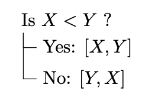
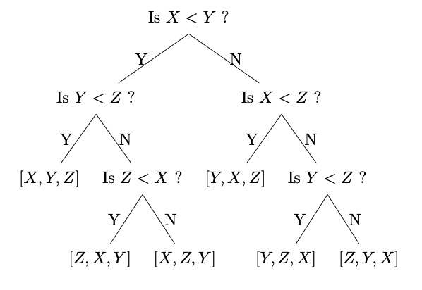
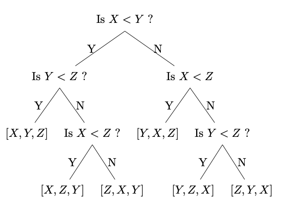
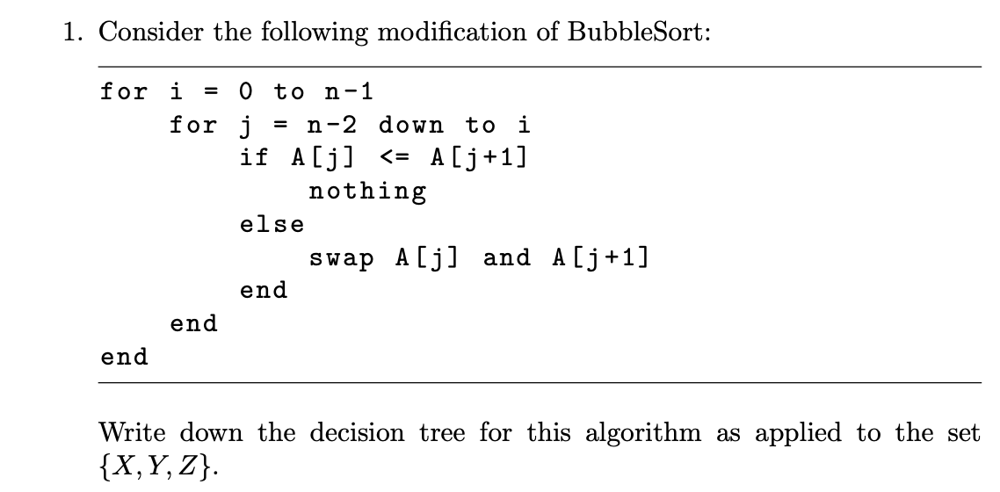

# 🔰 Algorithms Limitations on Comparisions
Class: <a href=""> </a>

Subject: #

Date: 2023-03-28

Topics: #, #, # 

---

# 🎬 Intro to Limit on Comparison Sorting

- Selection Sort, Insertion Sort, Bubble Sort, Merge Sort, HeapSort, and Quick Sort are all **based on making comparisons**.
- Sometimes we shift, sometimes we swap


# 🌲 Intro to Decision Tree

Fastest sorting algorithms, worst-case time complexity:
$$T (n) = Θ(n lg n)$$
Is there some sorting algorithm with better (smaller) time complexity $Θ(n lg n)$?

# 🫵 Decisions
- Comparisons lead to decisions such as “If X > Y do this, otherwise do that”. 
- There always a minimum number of decisions that the algorithm must make. Consider these examples of lists and sorting them.

## 1️⃣ Example
- Suppose list = [X,Y] needs to be sorted.


- Done, array sorted.


## 2️⃣ Example
- Suppose list = [X,Y,Z] needs to be sorted.


We can rebuild the decisions as a **Binary Tree**:




# Decisions Tree for an Algorithm

```python
# Bubble Sort
for i = 0 to n-1
    for j = 0 to n-i-2
        if A[j] <= A[j+1]
            nothing
        else
            swap A[j] and A[j+1]
```

Let’s see how this works on a list of length 3, BubbleSort will check...
- Is A[0] < A[1]? Swap if false.  
- Is A[1] < A[2]? Swap if false.  
- Is A[0] < A[1] again? Swap if false.

We see that we have a List = [X,Y,Z]. There are 3 possible comparisson in the tree:
- X < Y
- Y < Z
- X < Z

There are six possible ways that the data might be related:
**Note**: `Automatically true` won't appear in the tree

1. If X < Y < Z then starting with A = [X, Y, Z], BubbleSort will check...
- Is A[0] < A[1], meaning X < Y? True.  
- Is A[1] < A[2], meaning Y < Z? True.  
- Is A[0] < A[1], meaning X < Y? Automatically true.

2. If X < Z < Y then starting with A = [X, Y, Z], BubbleSort will check...
- Is A[0] < A[1], meaning X < Y? True.  
- Is A[1] < A[2], meaning Y < Z? False. Swap. Now A=[X,Z,Y]
- Is A[0] < A[1], meaning X < Z? True.

3. If Z < X < Y then starting with A = [X, Y, Z], BubbleSort will check...
- Is A[0] < A[1], meaning X < Y? True  
- Is A[1] < A[2], meaning Y < Z? False. Swap. Now A = [X,Z,Y]
- Is A[0] < A[1], meaning X < Z? False. Swap. Now A = [Z,X,Y]

4. If Y < X < Z then starting with A = [X, Y, Z], BubbleSort will check...
- Is A[0] < A[1], meaning X < Y? False. Swap. Now A = [Y,X,Z]
- Is A[1] < A[2], meaning X < Z? True.  
- Is A[0] < A[1], meaning Y < X? Automatically true.

5. If Y < Z < X then starting with A = [X, Y, Z], BubbleSort will check...
- Is A[0] < A[1], meaning X < Y? False. Swap. Now A = [Y,X,Z]
- Is A[1] < A[2], meaning X < Z? False. Swap. Now A = [Y,Z,X]
- Is A[0] < A[1], meaning Y < Z? True.

6. If Z < Y < X then starting with A = [X, Y, Z], BubbleSort will check...
- Is A[0] < A[1], meaning X < Y? False. Swap. Now A = [Y,X,Z]
- Is A[1] < A[2], meaning X < Z? False. Swap. Now A = [Y,Z,X]
- Is A[0] < A[1], meaning Y < Z? False. Swap. Now A = [Z,Y,X]



- **Note**: at each branch (left hand as example), it must have the 3 possible comparissons
	- X < Y
	- Y < Z
	- X < Z

# Theorems
Assume $n$ is the Array size

- The total number of Leaves is:
$$\# Leaves = n!$$
- The Shortest Path to a Leaf is:
$$shortest\_path_{leaf} = n - 1$$
- If $h$ is the height of the tree, then # of Leaves is at most $2^{h}$
$$n! \leq 2^{h}$$
$$h \geq \log_{2}(n!)$$


# Analysis of Comparison-Based Sorting

- Any comparison sort requires, in the worst-case, $Ω(nlgn)$ comparisons
$$\# comparisons = Ω(nlgn)$$


# Problems

