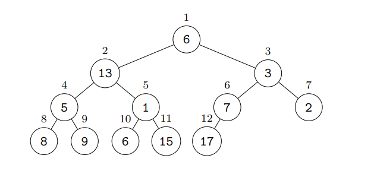

# Algorithms HeapSort
Class: [[Algorithms]]
Subject: #
Date: 2023-02-28
Topics: #, #, # 

---
# Complete Binary Trees
- It's a binary tree in which all levels are completely filled,
- Except possibly for the last level, and the last level has all entries as far left as possible.
- Note that the root is considered level 0.

## Binary Tree Index
- As in the picture we begin the node indexing at the root node at $i = 1$
- Instead of 0 as is usual for arrays and lists.
- The reason for this is that there are some convenient node calculations which emerge.

### Observations
- `Observation 1`: If a node has index $i$ then its` left` and `right` children (if it has them) have indices
	- $2i$
	- $2i + 1$ respectively.
- `Observation 2`: If a node has index $i$ $\Longrightarrow$ its `parent` has index $\lfloor{\frac{i}{2}}\rfloor$
- `Observation 3`: As a case of the above, 
	- If there are `n` nodes in total $\Longrightarrow$ the `largest node` with children is at index $\lfloor{\frac{n}{2}}\rfloor$
- `Observation 4`: If a node with index `i` has children  $\Longrightarrow$ all nodes with smaller indices also have children
- `Observation 5`: Combining `Observation 2` and `Observation 3`
	- If there are `n` nodes in total $\Longrightarrow$ the nodes with indices $1,2,..., \lfloor \frac{n}{2} \rfloor$ must have childrens.
# Intro to HeapSort

-