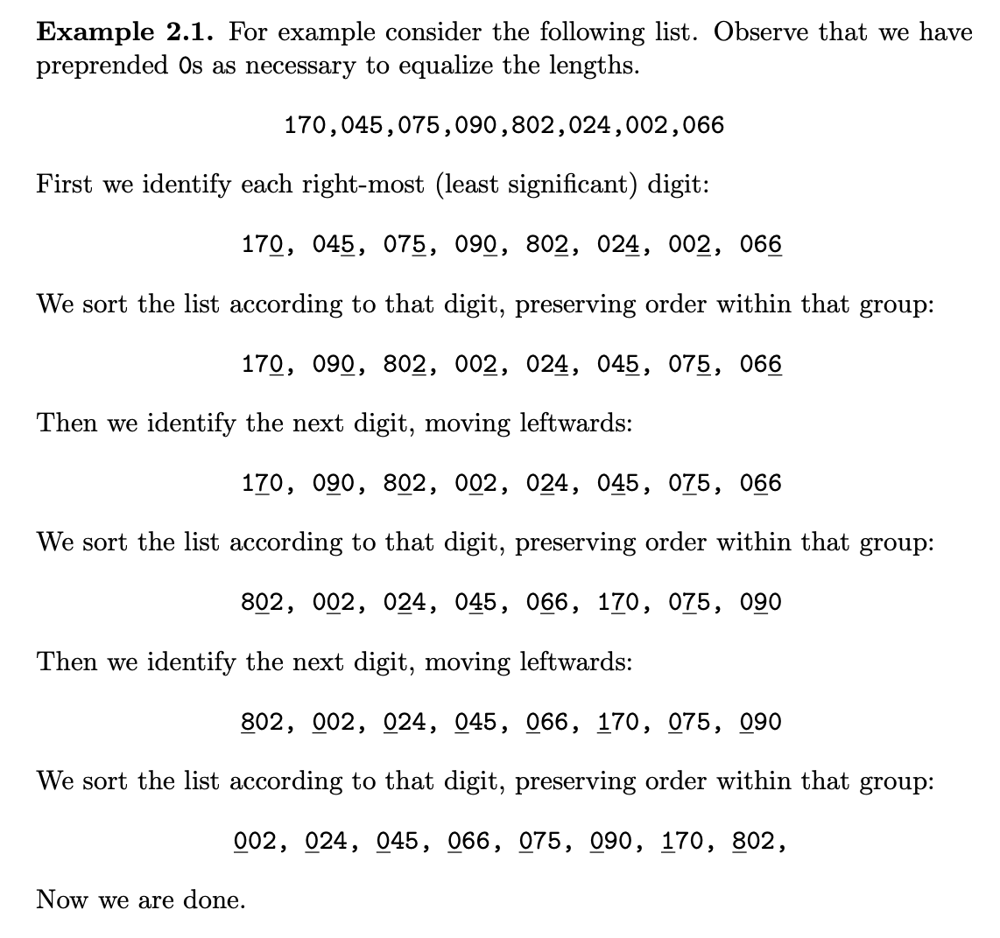
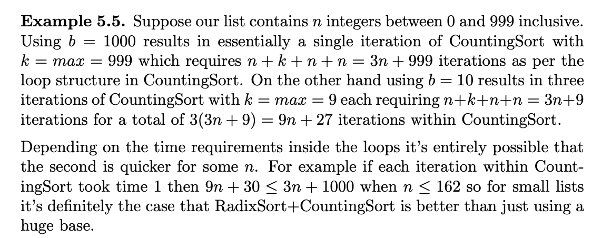

# 🔰 Algorithms RadixSort
Class: <a href="https://github.com/lamula21/cheat-sheets/blob/main/CMSC%20351%20Algorithms/Algorithms.md">Algorithms</a>

Subject: #

Date: 2023-03-28

Topics: #, #, # 

---
# 🎬 Intro to RadixSort
- RadixSort is not a comparison-based algorithm
- RadixSort depends on the stability of the underlying sort mechanism.
- RadixSort is `stable`
- RadixSort recurrence relation:
$$T(n) = Θ(d*(n+b))$$
- $d$ is the number of digits in the given list, 
- $n$ is the number of elements in the list, and 
- $b$ is the base or bucket size used, normally base 10


# ⏳ Running Time

- `Worst Case`
	- $Θ\left(   \right)$
- `Best Case`
	- $Θ\left(   \right)$
- `Average Case`
	- $Θ\left(   \right)$

# ⌛️ Space Time
- $Θ\left( n+b \right)$

# 🤷🏻‍♂️ What is RadixSort
- Sorts a list of integers in some base, aka radix. 
- For example positive integers in base 10 with $d$ digits all look like $x_{d}$...$x_{1}$ for digits $0 ≤ x_{i} ≤ 9$  
- For example positive integers in base 2 with d digits all look like $x_{n}...x_{1}$ for digits $x_{i} ∈ \{0, 1\}$




# ✏️ Pseudocode
```python
# A is a list of integers
for i = 1 to d
    stable sort A using digit i

# A is sorted
```

# 📝 Exercises



