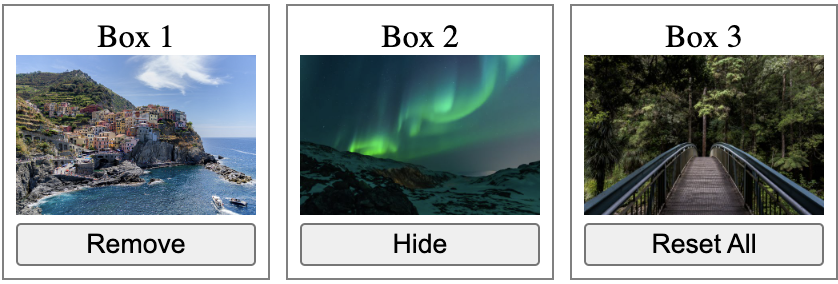
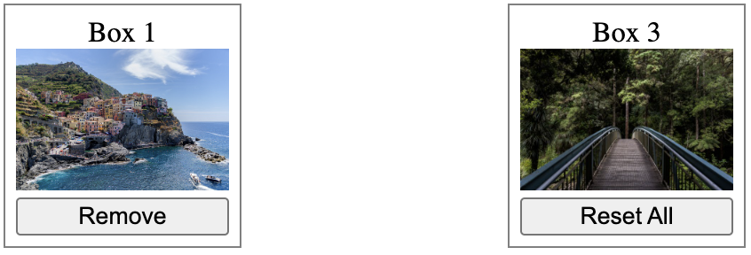
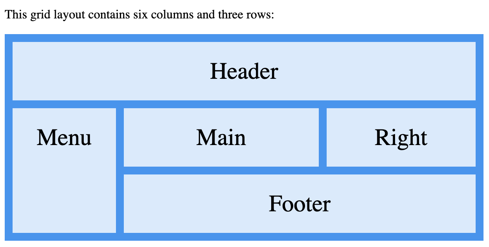
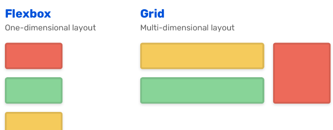

# 🎨 CSS Display
Class: <a href="https://github.com/lamula21/cheat-sheets/blob/main/css/CSS.md">CSS</a>
Subject: [[CSS]]
Date: 2023-02-08
Topics: #, #, # 

---

# 🎬 Intro to Display Properties
- The `display` property specifies if/how an element is displayed.
- Default `display`'s value for most elements is `block` or `inline`.
- We can modify the `display` of a element with CSS
- Display values:
	- block
	- inline
	- inline-block
	- none
	- flex
	- grid

# 1️⃣ Block
- Block elements always start in a new line
- Occupies full width available
- Default block-elements:
	- `<div> `
	- `<h1> - <h6>`
	- `<p>`
	- `<form>`
	- `<header>`
	- `<footer>`
	- `<section>`
```css
div {
	display: block;
}
```


# 2️⃣ Inline
- Inline element doesn't start in a new line
- Occupies what is necessary
- Default Inline-elements:
	-   `<span>`
	-   `<a>`
	-   ``
```css
div {
    display: inline;
}
```


## Inline-block
- The element is inline
- Inside of this element is formatted as a block 


# 3️⃣ None
- `display:none` - removes the element from the document. Does not take up any space. Usually used with `onclick` event in JavaScript to hide and show elements when clicked.
- `visibility: hidden` - hides the element, but it still takes up space in the layout.
- Default none-elements:
	- `<script>`
	- ...
```css
div {
    display: none;
    visibility: hidden;
}
```

Original Block:



After Remove pressed:


After Hide pressed:



# 4️⃣ FlexBox
- Layout system that enables flexible **one-dimensional** layouts for web pages
- Allows arrange elements in a row or a column, and adjust their sizes, spacing, and alignment.
- `Important`: parent element must have `display` property set to `flex`.
## Flex Common properties:
- `flex-direction`: Sets the direction of the flex container's main axis to either `row` (default), `column`, `row-reverse`, or `column-reverse`.
- `justify-content`: Aligns the flex container's items along the main axis (flex-direction axis).
	- `flex-start` (default), 
	- `flex-end` 
	- `center`
	- `space-between`
	- `space-around`
	- `space-evenly`
- `align-items`: Aligns the flex contaier's item along the opposite of main axis (opposite axis of flex-direction). 
	- `stretch` (default)
	- `flex-start`
	- `flex-end`
	- `center`
	- `baseline`
- `flex-wrap`: Controls whether the flex container's items should wrap or not. 
	- `nowrap` (default)
	- `wrap`
	- `wrap-reverse`
```css
.flex-container {
  display: flex; /* Change to block */
  flex-direction: column; /* row is the default. Try column, row-reverse */
  align-items: center; /* try center, flex-start, flex-end */
  justify-content: space-around; /* try space-between */
  flex-wrap: nowrap;  /* will never wrap its items when rezising windows */
}
.flex-container > div {
  background-color: blue;
  width: 100vh;
  margin: 10px;
  text-align: center;
  line-height: 75px;
  font-size: 30px;
}
```


# 5️⃣ Grid
- A layout system that allows **multi-dimensional** grid-based layouts to create complex and flexible layouts for web pages.
- `Important`: parent element must have `display` set to `grid`


## Grid common properties
- `display:grid`
- `grid-template-columns` and `grid-template-rows`: Defines the number and size of columns and rows in the grid. 
	- Use unit size: pixels, percentages, or fractions. 
	- Use the `repeat()` function to specify a repeating pattern of columns or rows.
```css
.grid-container { 
  display: grid; 
  grid-template-columns: 1fr 1fr 1fr; 
  grid-template-rows: auto auto; 
}
```

-  `grid-template-areas`: Defines a grid template by giving names to grid areas, which you can then refer to when placing items on the grid. 
	- You can use dots (`.`) to indicate empty cells in the grid.
```css
.grid-container {
  /* code */
  grid-template-areas:
    "header header"
    "sidebar main"; /* 2x2 grid */
}

.header { grid-area: header; }

.sidebar { grid-area: sidebar; }

.main { grid-area: main; }
```

- `grid-gap`: Sets the size of the gap between columns and rows in the grid (horizontal and vertical gaps)
```css
.grid-container {
  display: grid;
  grid-template-columns: 1fr 1fr;
  grid-template-rows: auto auto;
  grid-gap: 20px;
}
```

## Example
```css
.item1 { grid-area: header; }
.item2 { grid-area: menu; }
.item3 { grid-area: main; }
.item4 { grid-area: right; }
.item5 { grid-area: footer; }

.grid-container {
  display: grid;
  grid-template-areas:
    'header header header header header header'
    'menu   main   main   main   right  right'
    'menu footer footer footer footer footer';
  gap: 10px;
  background-color: #2196F3;
  padding: 10px;
}

.grid-container > div {
  background-color: rgba(255, 255, 255, 0.8);
  text-align: center;
  padding: 20px 0;
  font-size: 30px;
}
```
```html
<body>
  <h1>Grid Layout</h1>
  <p>This grid layout contains six columns and three rows:</p>

  <div class="grid-container">
    <div class="item1">Header</div>
    <div class="item2">Menu</div>
    <div class="item3">Main</div>  
    <div class="item4">Right</div>
    <div class="item5">Footer</div>
  </div>
</body>
```




## Grid vs Flex 


