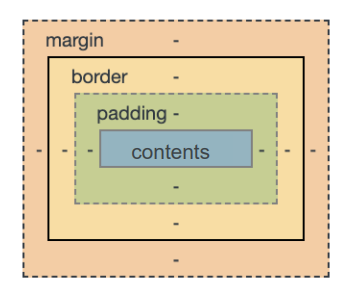
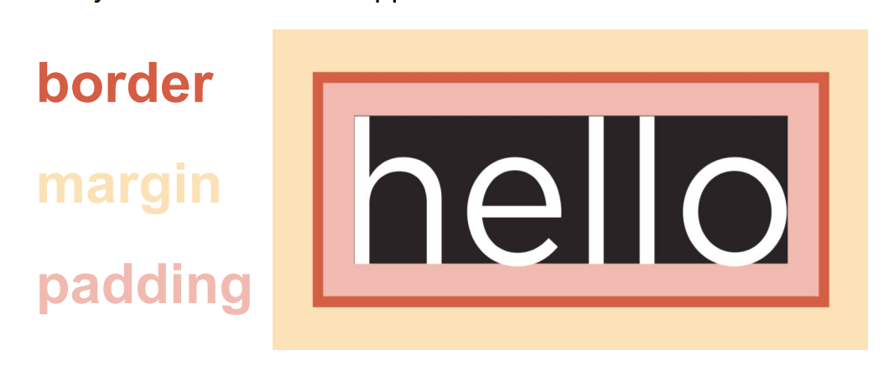

# Types of Selectors
Class: [[css/CSS]]
Subject: #
Date: 2023-02-06
Topics: #, #, # 

---

# Selectors

## HTML Elements
- General styling: All paragraphs will have same design
```css
p {
	text-align: center;
	color: red;
}
```

## ID
Unique ID for each HTML file susch that there cannot be two same IDs.
```css
#mi_id_unico {
  text-align: center;
  color: red;
}
```

```html
<p id="mi_id_unico">Lorem ipsum dolor sit amet</p>
```

## Class

## Universal Selector
- With a `*` symbol
	- From HTML, everything inside `<\p>` will be set to `red`
```css
p * {
	color: red;
}
```

## Child Selector
- With `>` symbol
- Matches when an element is the child of some element
```css
/* p has to be a immeadiate child of body */
body > p { line-height: 1.3 }
```
- Useful when you don't want to change the HTML file with `classes` selectors

## Attributes Selectors
- Works as a boolean
```html
<a href="http://www.umd.edu" title="news">News</a>
```

```css
a[title="news"] {
	color: red
}
```

## Lorem Ipsum


## Box Model
- CSS box model:
	- content: text, images, etc 
	- padding: white space between `border` and `contents`
	- border: box border
	- margin: whitespace outside of the box
- 
- 

## Shortcut
- Allows you to specify several properties by using only one
	- If you don’t specify one of the properties, a default value will be used
- Commonly used shorthand properties 
	- background
	- font
	- list-style
	- margin
	- border – padding

```css
.noShorthand {

    /* Font specification */
    font-style: italic;
    font-variant: small-caps;
    font-weight: normal;
    font-size: .80em;
    line-height: 1.1em;
    font-family: Verdana, Arial, sans-serif;

    /* Border specification */
    border-width: 2em;
    border-style: solid;
    border-color: green;

    /* Margin specification */
    margin-top: 6em;
    margin-right: 8em;
    margin-bottom: 4em;
    margin-left: 2em;
    
    /* Padding specification*/
    padding-top: 3em;
    padding-right: 4em;
    padding-bottom: 2em;
    padding-left: 1em;
}
```

```css
.withShorthand {

    /* Font specification */
    font: italic small-caps normal .80em/1.1em Verdana, Arial, sans-serif;

    /* Border specification */
    border: 2em solid green;

    /* Margin specification */
    margin: 6em 8em 4em 2em;

    /* Padding specification*/
    padding: 3em 4em 2em 1em;

    /* Description defining the color of each side */
    border-color: red green blue yellow;
}
```

## Background effects
```css
body {
	/* Background properties */
	font-family: serif; /* Try cursive */
	background-color: silver;
	background-image: url(campusBldg.jpg);
	background-size: 20% 30%; /* Try cover, auto auto */
	background-repeat: repeat-x; /* Try repeat-y, no-repeat, repeat */
	background-attachment: fixed; /* Try scroll */
	background-position: center; /* Try top, right, bottom, left */
	
	/* background-image: url(https://background-tiles.com/overview/white/patterns/large/1029.png); */
}
```

## Media Query
- Uses the `@media` rule to include a block of CSS rule only if a certain condition is true
- Sets the background color only if the browser window is 600px or smaller
```css
@media only screen and (max-width: 600px) {

	body {

		background-color: purple;

	}

}
```

## Generic Font Families
- serif
	- Examples: Times New Roman, Georgia
- sans-serif
	- Examples: Verdana, Arial
- monospace
	- Example: Courier New, Consolas
- cursive
- fantasy
	- Comic Sans MS, …
- Specify a generic family 
	- font-family: serif;