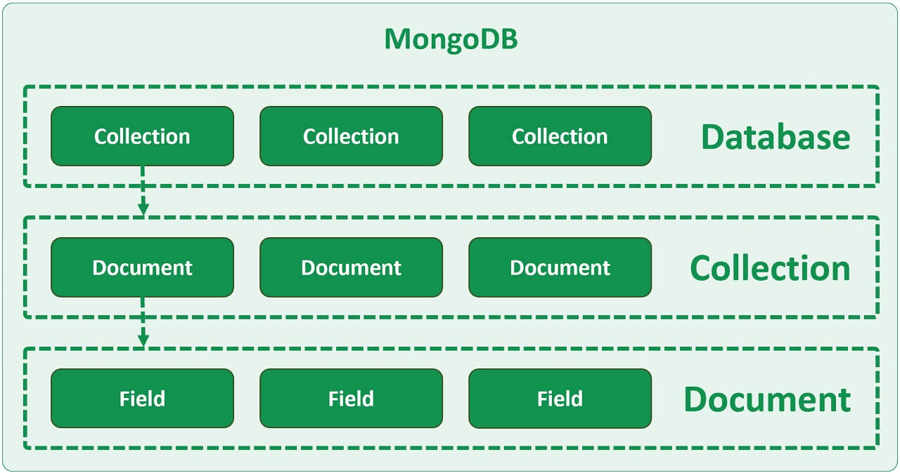

# 🌶️ Flask MongoDB
Class: [[flask/Flask]]
Subject: #
Date: 2023-03-04
Topics: #, #, # 

---

# 🔗 Connecting to MongoDB locally
- Install mongoDB with FLask
```shell
pip3 install FLask-MyMongo
```

## Create Database
- Start mongoDB with `mongosh` and get the localhost address

- Connect MongoDB with app and create a database by replacing `localhost` adress and  `<database-name>`
```python
app.config["MONGO_URI"] = "mongodb://1237.0.0.1:27017/<database-name>"
```

## Getting SECRET_KEY
```python
# In terminal
python3 -c "import os; print(os.urandom(16))"

# In app.py
app.config['SECRET_KEY'] = b'r\\\xe5Xy...\xbd'
```

## Connecting Py with Mongo
- We can use `mongo.db` to reference our MongoDB
```python
from flask_pymongo import PyMongo

app = Flask(__name__)
mongo = PyMongo(app)
mongo.db # our database
```

# ➕ Add Collections
 - Let's say we want to create our collection structured like
```python
users = [{
	'name': 'Yashas'
	'location' : 'Finalnd',
	'age' : 42,
},
{
	 'name' : 'Kenton',
	 'location' : 'Peru'
	 'age' :32,
}]
```

 - To achieve, this can create a collection called `users` into our database
```python
mongo.db.users
```

# ➕ Add Multiple Documents
- Suppose we have a `document` for one user
```python
new_users = [{
	'name': 'Matias'
	'location' : 'Argentina',
	'age' : 22,
	}
	{
	...
	}
]
```
- We want to add this `document` into our `collection` called **users** 
```python
mongo.db.users.insert_many(new_users)
```

# 🔎 Find Document in Collection
- To querying multiple documents
```python
for user in mongo.db.users.find():
	print(user['name'])
```

## Filtering Data
- To filter data, we can add arguments into `find()`
```python
for user in mongo.db.users.find({'age': 31}):
	print(user['name'])
```

- How about filtering for specific age greater than 20
```python
for user in mongo.db.users.find({ 'age': {'$gt': 20} })
```

## ⛔️ Note
- The `find()` returns an `Cursor` object
- It might conflict if we are treating this as a collection
- Fix by encapsulating: `list()`, `dict()`, ...,  etc

# 🆕 Create Unique Indices in MongDB
- Each `document` has their unique `_id`
- Let's say for example, 
	- An user for a login webpage has an unique `_id`


## Unique Key
- What if we want to create another unique key for specific data, such as `name`
	- So we create an index, with unique parameter set to `True`.
```python
db.users.create_index( [('name' , flask_pymongo.ASCENDING)], unique=True )

print(list(db.profiles.index_information()))

>>>[u'_id_', u'user']
```


# 🆚 Collection vs Document
- These 2 documents above forms a `collection`


# ✅ Useful Mongosh Commands
- Switch to another database in Mongosh, `use <database>` command
```python
use mydatabase
```

- Retrieve all users in DB using Mongosh
```python
db.getUsers()
```

- Return a list of all the collections in the `mydatabase` database.
```python
db.getCollectionNames()

returns => [ 'user', 'images.chunks', 'review', 'images.files' ]

```

- Check the contents of the `user` collection in Mongosh
```python
db.user.find()

db.user.find({ username: "john" })
```

