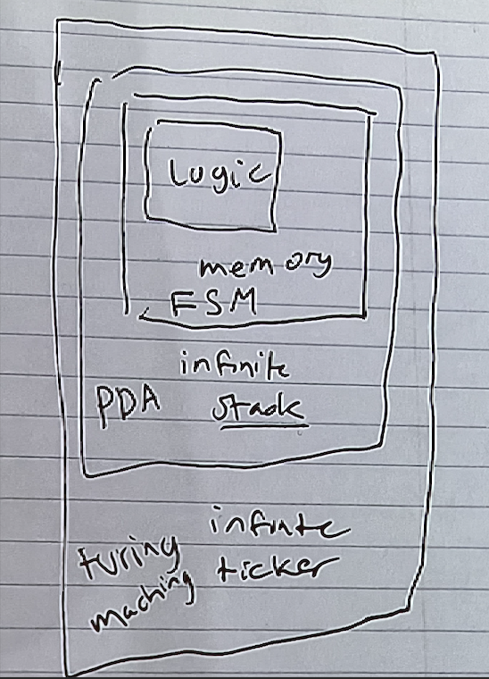
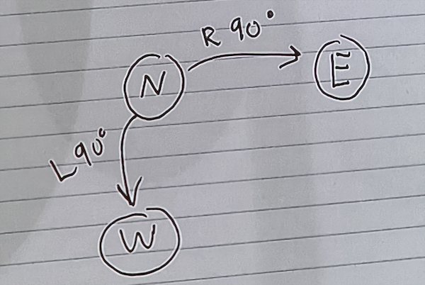

# 🐫 OCAML Finite State Machines

📚Class: CMSC 330 Organization of Programming Languages 

📓Subject: OCAML 

✏️Section: 0105

📅Date: 2023-03-02

---

# 🎬 Intro to Finite Machines

- In OCaml, a finite machine is a type of state machine that can only exist in a finite number of states.
- It is also known as a finite state machine (FSM) or a deterministic finite automaton (DFA).

Simple Hardware:
- logic
- Memory (Finite State Machine) <- topic of today
- Infinite stack (PDA)
- Infinite ticker
	- long list of 0 and 1s
- Turing Machine

## Finite State Machine
- In OCaml, you can represent a finite machine using a record type. 
- The record will contain the current state of the machine and a function that will determine the next state based on the input.

All possible states of the universe
- like turn right
- turn left
- etc

# 🤯 Regular Expression
- Regular expressions and finite state are closely related concepts
- A regular expressions is a pattern that describes a set of strings.
- Finite state machine is a model of computation that can recognize (or generate) a set of strings
- In practice,
	- Regular expressions are often used to specify patterns for text search and manipulation
	- Finite states machines are used for tasks such as lexical analysis, parsing, and pattern recognition.
- traverse a machine
- match with a machine

- Regular expressions comforms of
	- /^abc$/
	- it must have an alphabet: set of symbos we allow
	- Single symbol: a, b, c
	- Concatenation: ab , ba, cab
	- Repittion: aaa -> a{3}
	- OR | branching -> (C | K)liff 

# Definition
- Alphabet: $\sum$
- Language: {$a, aa, ab, b, c , cab, ...$}
- Single symbol: {a}, , {b} , {c}
- Regex (R) → 
	- ø
	- ε → empty string
	- $R_{1}$ $R_{2}$ → Concatenation 
	- $R_{1}$|$R_{2}$ → Branching / OR
	- $R_{1}^{*}$ → Inifinite repitition
- Shortcut
	- a{3} = / (a | aa | aaa) /

